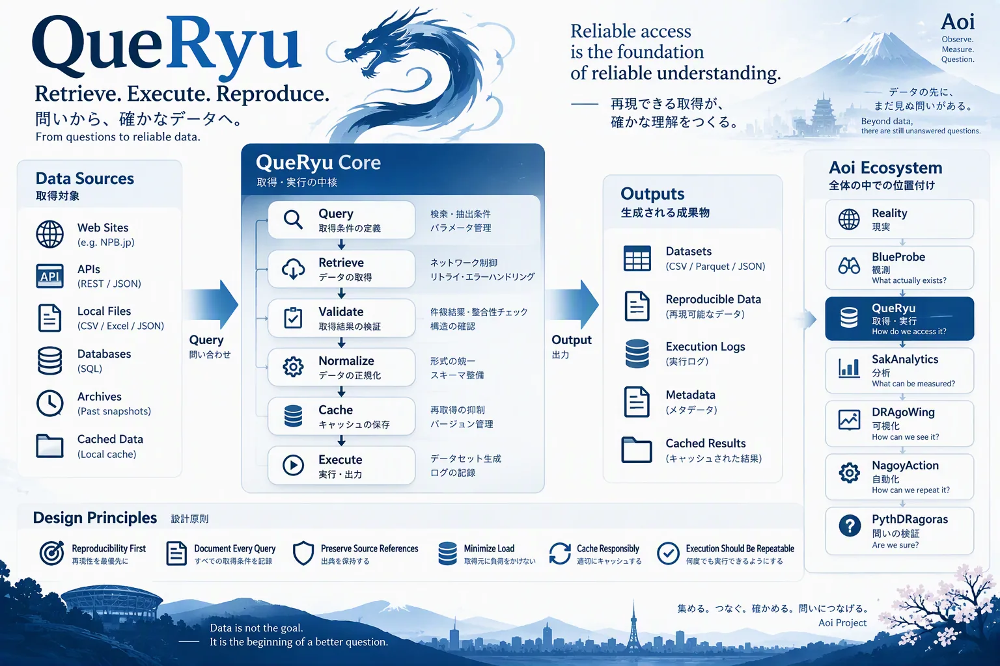

# QueRyu

> 再現できる取得が、確かな理解をつくる。



*イメージ図（構想を共有するための図。実際のデータ・HTML構造ではない）*

取得と、観測データセットの作成を担う。取得元への負荷を抑え、いつ・どこから・どのコードで取ったかを必ず残す。

## 取得元への配慮

- 取得済みのページは再取得しない。進行中の期間（例: 今年のシーズン）だけ、条件付きGET（`If-Modified-Since` / `If-None-Match`）で更新を確認する
- 存在しないページ（404）も「空」として記録し、二度と問い合わせない
- 直列で、既定3秒の間隔を空ける。5xx は保存しない
- `--offline` ではネットワークに一切出ない（キャッシュにないページは止まる）

## 一度だけ取る（取得台帳）

取得元に同じページを二度取りに行かないことを、決まりとして守る（ユーザーの方針、2026-10-05）。

- 生の HTML は1ページ1回だけ取り、gzip のまま保存する。解析の規則を直すときは、保存したページから作り直す（`--offline`）。取り直して直すことはしない
- **取得台帳**（`--ledger`）: 取ったページの来歴だけ（`key, url, group, status, sha256, bytes, fetched_at`）を git に残す。中身は残さない（公開リポジトリなので、生のページは再配布しない）
- 台帳にある過去シーズンのページがキャッシュから消えていたら、**黙って取り直さずに止まる**（`RefetchRefused`）。取り直すかは人が決め、`--allow-refetch`（GitHub Actions では手動実行の `allow_refetch`、環境変数 `AOI_ALLOW_REFETCH=1`）のときだけ取る
- 取り直したページの `sha256` が台帳と違えば `changed` に数える（ページが後から変わったことの記録）
- 進行中のシーズン（`live`）は台帳があっても条件付きGETで確認してよい
- キャッシュは GitHub Actions のキャッシュ（7日間使われないと消える）にある。`cache-keepalive.yml` が週1回読んで消えないようにする（main に入ってから動く）
- 量の大きい取得元（試合ごとのページ、1年 約860ページ）は、年を絞って取り、形と照合を確かめてから広げる

## 来歴

キャッシュの `manifest.jsonl` に、取得ごとに1行を追記する。304（更新なし）も「確認した」記録として残す。

```text
key, url, group, status, file, sha256, bytes, fetched_at, last_modified, etag, code_version
```

`code_version` は git のコミット。測れなければ `null` のまま（推測で埋めない）。

## データセット

`data/observations/<source>/<entity>.jsonl`（1記録1行、`key` で一意）と、隣の `.manifest.json`（取得元・範囲・正規化の内容・採用しなかった件数・未知の件数・SHA-256・コードの版）。
生の観測を含むので `data/` は git に入れない。

```bash
uv run python QueRyu/queryu.py --source npb_calendar --years 2012-2025 \
  --cache data/raw/npb_calendar --out data/observations/npb_calendar/games.jsonl [--offline]
```
