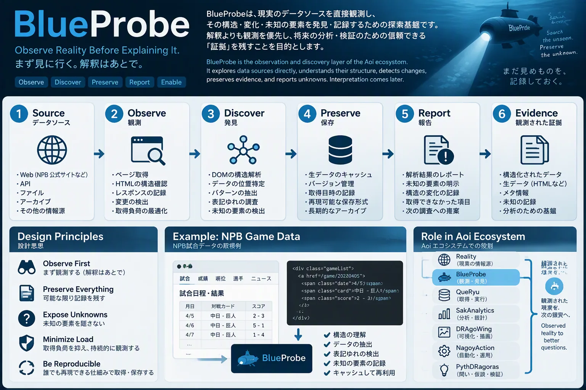

# BlueProbe

> まず見に行く。解釈はあとで。



*イメージ図（構想を共有するための図。実際のデータ・HTML構造ではない）*

観測と発見を担う。取得したページを読み、**何がそこにあるか**を記録する。勝敗や原因の判断はしない。

## 構成

| ファイル | 役割 |
|---|---|
| `blueprobe.py` | 取得元に依存しない部分: 正規化、報告の契約、オフライン再解析（`inspect`） |
| `npb_calendar.py` | 取得元: npb.jp の月別公式戦カレンダー |
| `docs/npb_calendar.md` | その取得元で、どの年の何を確認したか（観測と未確認を分ける） |
| `docs/antipatterns.md` | 繰り返しそうな失敗とその約束 |
| `tests/cases/*.jsonl` | 表記揺れのコーパス（xprobe と同じ id / category / value / reason 形式） |

## 報告の契約

1ページを読んだ結果は、採用したものだけでなく、採用しなかったものも返す。

```text
records : 採用した観測（原文と派生値を並べる）
counts  : 採用しなかったものの区分ごとの件数（例: cancelled, non_regular）
unknown : どの区分にも当たらなかったもの。原文を残す → 表記の変化を疑う
```

## 取得元を足す

`blueprobe/<name>.py` に次の2つを書けば、QueRyu と `inspect` からそのまま使える。

```python
def pages(scope) -> list[tuple[str, str, str]]: ...   # (key, url, group)
def parse(html: str, url: str) -> dict: ...          # new_report() の形で返す
def check(records) -> list[str]: ...                 # 任意。既知値との照合
```

正規表現は狭く、全体一致で書く。新しい表記を見つけたら、広げる前にコーパスへケースを足す。

## 実行

```bash
uv run python blueprobe/blueprobe.py --source npb_calendar --cache data/raw/npb_calendar --out observed.md
```

キャッシュだけを読み、ネットワークには出ない。未知の表記があれば件数を表示する（`--strict` で終了コード1）。

## 保存HTMLの共通抽出へ接続する

`html_source.HtmlSource(selector=..., extractor=...)` は、取得済みHTMLを信頼した
オフライン抽出関数へ渡し、既存の `inspect()` の報告形式に変換する。
取得・キャッシュ・NPB固有の観測は引き続き既存モジュールが担当する。
抽出できない構造は `extraction_failed` と原文付き `unknown` に残す。
同じページの抽出条件変更や再実行では、リンク先・CSSを含めて通信しない。

```python
from html_source import HtmlSource
from mcp_toolcall_lab.adapters.html_snapshot import extract

source = HtmlSource(selector="main#calendar > .day", extractor=extract)
rows = inspect(source, saved_pages, records_out)
```

上記はマージ済みの lab PR [#110](https://github.com/myon-bioinformatics/mcp-toolcall-lab/pull/110)・
[#111](https://github.com/myon-bioinformatics/mcp-toolcall-lab/pull/111) の抽出関数を使う任意の接続例。
BlueProbeはそのパッケージを自動インストールしない。通常のNPB解析に新しい依存はない。
`--source html_source` はlabの抽出モジュールが利用可能な環境でgeneric抽出を行う。
selectorはタグ、`#id`、`.class`、子要素 `>`、子孫の限定的な構文で、
CSSの描画・JavaScript実行・HTML5ブラウザDOM再構築を意味しない。
全CSS構文への対応やPages上のPython実行は保証しない。

### 検証済みキャッシュから snapshot を再利用する

`inspect_cache(source, cache, entries=None, records_out=None)` は QueRyu の照合済み
本文を読む。既定では最新行、`entries` を指定すると選んだ取得時点の行を使う。
NPB parser には原文HTMLをそのまま渡す。snapshot対応の `HtmlSource` には
`Cache.snapshot()` の envelope を渡し、既存の
`mcp_toolcall_lab.source_access.extract_snapshot` で検証・抽出する。
独自 validator や HTML parser は増やさない。
ここでの再解析はHTML構造の抽出・観測値の読み取りを指す。集計・指標計算は
[SakAnalytics](../sakanalytics/README.md)、仮説評価は
[PythDRagoras](../pythdragoras/README.md) が担う。

```python
from blueprobe import inspect_cache
from html_source import HtmlSource
from queryu import Cache

records = []
rows = inspect_cache(HtmlSource(selector=".calendar a"), Cache("data/raw/npb_calendar"),
                     records_out=records)
```

`--source html_source --cache ...` の CLI もこの経路を使う。
`derived` は従来の抽出結果を維持し、`snapshot` に共有検証が返す属性、
`cache_entry` に元の来歴を残す。任意の注入関数は
`HtmlSource(snapshot_extractor=...)` で明示する。引数は snapshot 辞書と抽出条件、
戻り値は lab と同じ `snapshot` / `extraction` の辞書。
従来の `parse(html, url)` / `extractor=...` は raw HTML 用として残し、
保存済みバイトの照合を行ったことにはしない。

QueRyu の hash/長さ不一致は抽出前にエラーで止まり、欠けた過去本文を自動取得しない。
lab は schema・URL形式・上限サイズ・decoded content hash を検査するが、
URLや取得時刻の真実性・応答の真正性までは検証しない。来歴が不明なら不明のまま残す。
ソースcheckout・CI runner identityの実行管理は NagoyAction 側の責務であり、
BlueProbe runtime に checkout検証や runner は追加しない。

### CSSを読む・既存NPB解析と比べる

`HtmlSource(include_css=True, stylesheets={saved_url: saved_css}, extractor=extract)`
で埋め込み・inline・明示した保存CSSの宣言を読む。色番号、CSS変数、重要指定、
条件付きルール、selectorとHTML要素の一致をderived側に残す。
外部stylesheetと@importは取得せず未読参照として残す。CSSごとのハッシュも残す。
未対応selectorはunsupported、一致なしはunmatchedと区別する。
表示色・継承・詳細度・変数解決・画面サイズ条件は計算せず、computed_stylesはfalse。
CSSが読めたことを、画面を再現できたこととして扱わない。

`html_compare.compare_calendar()` は、保存HTMLからselectorで読んだリンク群と、
既存 `npb_calendar.parse()` が採用した試合URLを比較する。
採用試合の欠落、リンク重複、抽出失敗を返す。元HTMLをNPB parserにそのまま渡すので、
大会見出し・中止・未知表記の判定は既存処理が保持する。
`complete_for_adopted_games` は既存parserが採用した試合に対する被覆だけを意味し、
parser自身が未知の試合を取りこぼしていないという証明ではない。
NPB保存fixtureの4試合・中止1件・非公式戦1件を用いて比較する。
同じ原文を何度再解析しても新規GETはしない。labなしの通常NPBテストは従来どおり動く。

### 固定した実装でオフライン統合テストを再現する

CI の `Offline lab integration (Python 3.14)` は、lab のマージコミット
`6a3fe3aac7e5ae939d2fe2720dfae002d5f0dd90` を `.test-deps/lab` に別途 checkout する。
`src` をテスト時の `PYTHONPATH` に追加し、事前確認で SHA と
`html_snapshot`・`css_inspect`・`source_access` の import 元を照合する。import 元は
実テスト内でも確認する。単一ファイルのコピー、lab の自動インストール、実行時の取得はしない。
通常の Python 3.11–3.15 のテスト行列は lab なしで維持し、統合テストは 3.14 のみで行う。
全 Python 版での lab 統合を検証したという意味ではない。

Aoi のリポジトリルートで実行する（clone はテスト前の準備で、抽出中の通信ではない）。

```bash
git clone https://github.com/myon-bioinformatics/mcp-toolcall-lab.git .test-deps/lab
git -C .test-deps/lab checkout --detach 6a3fe3aac7e5ae939d2fe2720dfae002d5f0dd90
test "$(git -C .test-deps/lab rev-parse HEAD)" = 6a3fe3aac7e5ae939d2fe2720dfae002d5f0dd90
export AOI_LAB_SOURCE_ROOT="$PWD/.test-deps/lab/src"
export PYTHONPATH="$AOI_LAB_SOURCE_ROOT"
uv run --locked --python 3.14 python - <<'PY'
import os
from pathlib import Path
from mcp_toolcall_lab.adapters import css_inspect, html_snapshot
from mcp_toolcall_lab import source_access
root = Path(os.environ['AOI_LAB_SOURCE_ROOT']).resolve()
for module in (html_snapshot, css_inspect):
    expected = root / 'mcp_toolcall_lab/adapters' / (module.__name__.rsplit('.', 1)[1] + '.py')
    assert Path(module.__file__).resolve() == expected, module.__file__
assert Path(source_access.__file__).resolve() == root / 'mcp_toolcall_lab/source_access.py'
PY
uv run --locked --python 3.14 pytest -q --require-lab-integration \
  blueprobe/tests/test_blueprobe_html_source.py::test_optional_real_lab_extractor_reuses_all_calendar_rows \
  blueprobe/tests/test_blueprobe_html_compare.py::test_real_saved_npb_fixture_coverage_and_css \
  blueprobe/tests/test_blueprobe_html_source.py::test_verified_cache_real_lab_snapshot_replay \
  --junitxml=build/test-results/lab-integration-3.14.xml
# lab ありの全テスト
uv run --locked --python 3.14 pytest -q --require-lab-integration
# lab なしの通常テスト。別途 lab をインストールしていない環境で実行する。
unset PYTHONPATH AOI_LAB_SOURCE_ROOT
uv run --locked --python 3.14 pytest -q
```

`--require-lab-integration` は実 extractor の3テストを必須にし、未収集・skip・
import 失敗を成功扱いにしない。通常モードでは lab がない場合のみ任意統合の3件を skip する。
これらのテストは socket 接続を遮断し、31行の抽出、保存 NPB HTML の4試合の被覆、
重複、中止1件・非公式戦1件、保存外部 CSS、未対応 selector、再実行の一致を検証する。
外部 CSS のリンクや `@import` を自動取得しないことも確認する。
統合 JUnit は失敗時も保存し、集約側は通常5件と統合1件の計6レポートを必須にする。

以下は PR #15 時点の過去のローカル検証（2026-10-09、Python 3.14.8、固定 lab SHA、Aoi の locked 依存）:

- 実 extractor の必須2テスト: 2 passed / 0 skipped
- lab ありの全テスト: 533 passed / 24 skipped
- lab なしの全テスト: 531 passed / 26 skipped

共通の24 skip は任意の season simulator 用依存がないためで、この統合とは別のもの。
当時の lab なしではさらに実 extractor の2テストを skip した。初回 PR 本文の `284 passed` は
過去の検証記録であり、現在の全テスト件数として扱わない。CI の結果は
[PR #15](https://github.com/myon-bioinformatics/Aoi/pull/15) の最新実行で確認する。
