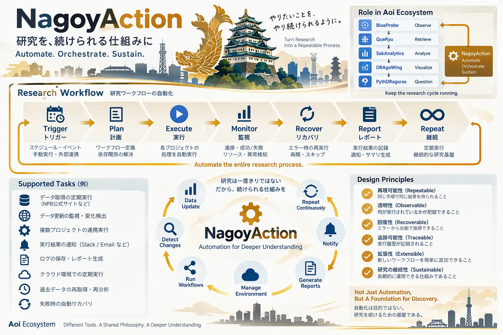

# NagoyAction

> 研究を、続けられる仕組みに。



*イメージ図（構想を共有するための図。実際のデータ・HTML構造ではない）*

パイプラインを TOML に一度だけ書き、**ローカルでも GitHub Actions でも同じコマンド**で動かす。
データを外に出せない案件では、同じ定義をローカルで実行すればよい。

```bash
python nagoyaction/nagoyaction.py doctor cycles/c001-chunichi/pipeline.toml            # 実行前の確認
python nagoyaction/nagoyaction.py run    cycles/c001-chunichi/pipeline.toml            # 実行
python nagoyaction/nagoyaction.py run    cycles/c001-chunichi/pipeline.toml --offline  # 取得しない
python nagoyaction/nagoyaction.py run    cycles/c001-chunichi/pipeline.toml --dry-run  # 何をするかだけ表示
```

- `doctor`：Python の版、必須ツール（例: git, uv）、任意ツール（例: gh）、オフライン実行に必要な成果物の有無を確認する。足りなければ終了コード1で、実行前に止まる
- `run`：doctor のあと手順を順に実行し、`--receipt` に受領記録（JSONL）を残す。失敗した手順で止まる
- 手順はシェルを通さず、引数の配列で実行する
- 標準ライブラリだけ（Python 3.11+）。このファイル1つをコピーすれば他のリポジトリでも使える

GitHub Actions のワークフローは、このコマンドを呼ぶだけにする（例: `.github/workflows/cycle-c001.yml`）。
組織共通の再利用ワークフロー（actionlint など）は `myon-bioinformatics/myon-bioinformatics` のものを使う。
他のリポジトリから共有モジュールを取り込むときは、同リポジトリの `vendor_sync.py`（SHA 固定）を使う。

## リンク確認（`linkcheck.py`）

```bash
python nagoyaction/linkcheck.py                                    # push 前: git 登録済み・大文字小文字一致で照合
python nagoyaction/linkcheck.py --remote OWNER/REPO --ref BRANCH   # push 後: そのブランチに実在するか（gh api）
python nagoyaction/linkcheck.py --external                         # http(s) も確認（404/410 だけ失敗）
```

GitHub は大文字小文字を区別するので、手元で開けても GitHub では 404 になることがある（例: `genesis.md` と `GENESIS.md`）。
`git add` を忘れたファイルも、手元にはあるが GitHub にはないので失敗にする。CI では両方を実行する。
