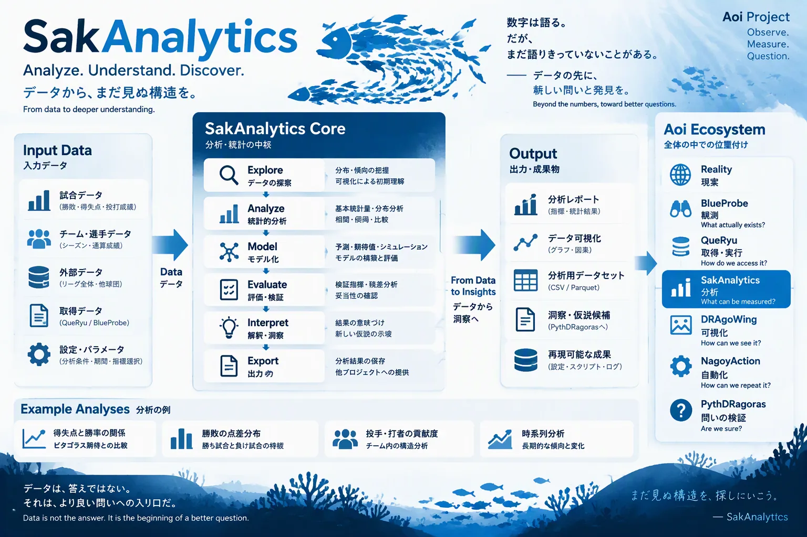

# SakAnalytics

> 数字は語る。だが、まだ語りきっていないことがある。



*イメージ図（構想を共有するための図。実際のデータ・HTML構造ではない）*

観測データセット（1試合1行: `key, date, home, away, hs, as`）から、チーム×シーズンの指標を作る。
測るだけで、除外や良し悪しの判断はしない（それは PythDRagoras と分析設定の仕事）。

チームの所属と表示名は分析設定の `[teams]` で明示的に与える。定義のないチームが現れたら、黙って捨てずにエラーにする。

主な列は `sakanalytics.py` の冒頭に一覧がある。順位（`rank`）は勝率から計算した派生値で、
公式の同率時の規定は再現しないため、同率には `rank_tie = true` の印をつける。

```bash
uv run python sakanalytics/sakanalytics.py --games data/observations/npb_calendar/games.jsonl \
  --config cycles/c001-chunichi/analysis.toml --out cycles/c001-chunichi/outputs/season.jsonl
```
